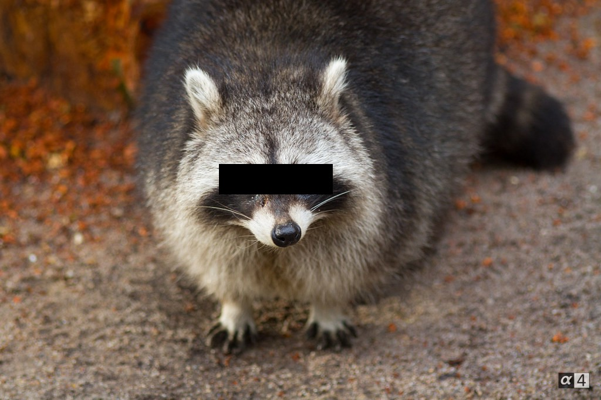

# bloc

Simple tool to add single color rectangles to images quickly.
Can be used to hide faces or other recognizable information.




It uses [raylib](https://www.raylib.com/) for display
and [arena.h](https://github.com/tsoding/arena) for memory management.

## Quickstart

```console
$ make
$ ./bloc foo.jpg -o bar.jpg
```

## Rationale

Any general painting program should allow you to lay plain color rectangles over an image.
That is an easy and useful task when you need to hide certain information on an image.

The problem I have with these programs is their generality.
When I open something like [GIMP](https://www.gimp.org/) (which may take some precious seconds)
I am greeted with hundreds of options.
As I am not an experienced user I need to figure out every time freshly how to do my simple task.

This project aims to simplify this process by providing a specialized tool with an ergonomic UI.
I want to use the mouse only where necessary mainly for two reasons:

- I am already used to the command line
- often I do not have a mouse but a touchpad which is less ergonomic but should do the task nethertheless

I.e. the mouse should only be used for placement of the blocks on the image and for navigation **on** the image.
Functionality like 'save to file' or 'undo/redo' should be handled by command line options or keyboard shortcuts.
